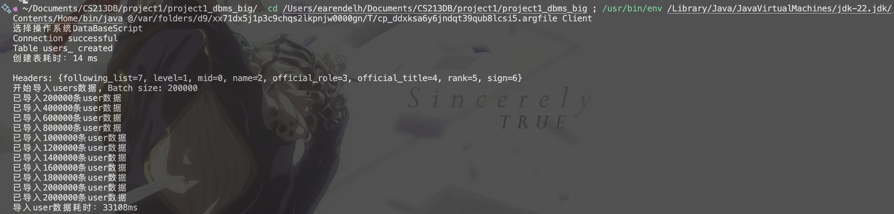
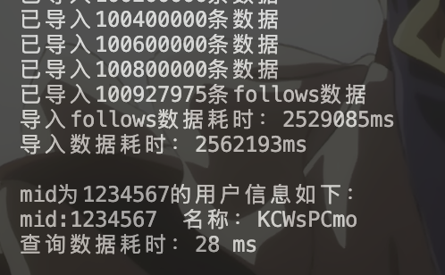
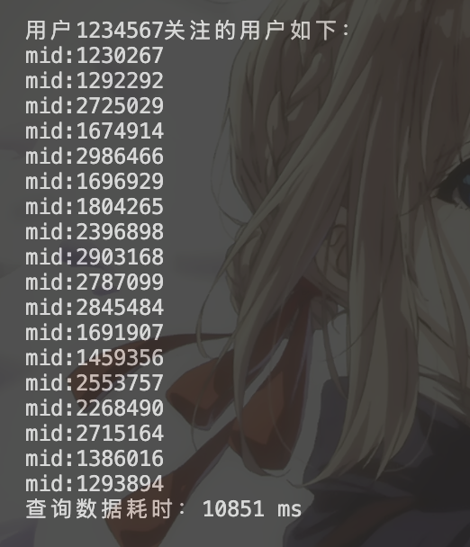
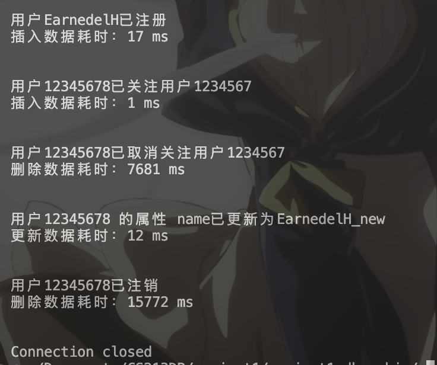
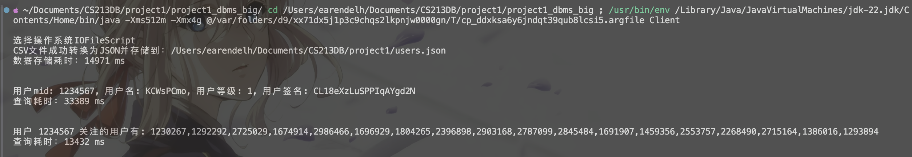
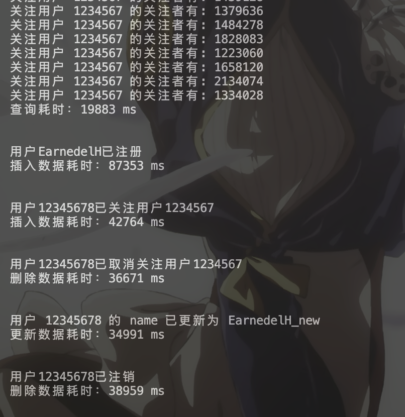
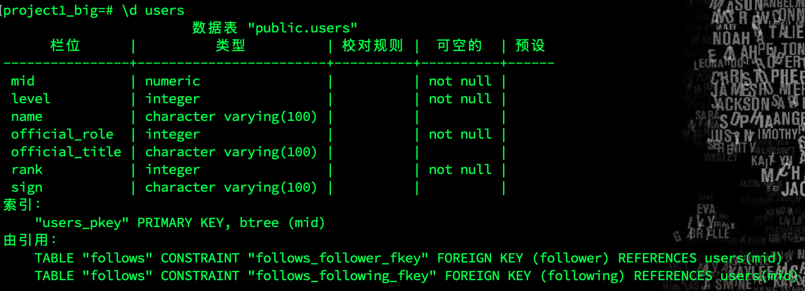
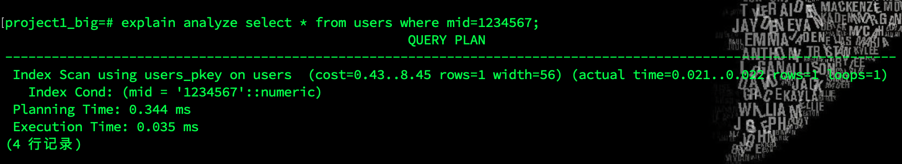
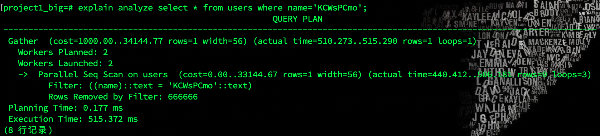
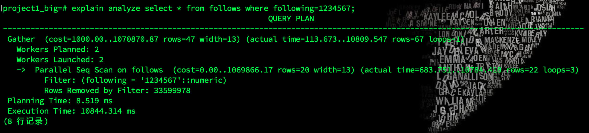

# CS213 Database Project1

- **Student Name: 王子恒**

- **Student ID: 12310401**

## 目录

- [CS213 Database Project1](#cs213-database-project1)
  - [目录](#目录)
  - [引言](#引言)
    - [背景查询](#背景查询)
    - [project目的](#project目的)
    - [研究问题](#研究问题)
    - [Report结构](#report结构)
  - [数据源](#数据源)
  - [B站每周必看数据集（较小数据单表的I/O与JDBC对比）](#b站每周必看数据集较小数据单表的io与jdbc对比)
    - [数据库设计](#数据库设计)
    - [数据导入](#数据导入)
    - [IO与DBMS功能](#io与dbms功能)
    - [程序实现](#程序实现)
      - [运行环境](#运行环境)
      - [数据预处理](#数据预处理)
      - [psql下建表及导入数据](#psql下建表及导入数据)
      - [DBMS以及IO数据导入](#dbms以及io数据导入)
    - [性能测试](#性能测试)
      - [JDBC](#jdbc)
      - [I/O](#io)
  - [B站user和user制作的短视频数据（较大数据关系型数据库与文件系统对比）](#b站user和user制作的短视频数据较大数据关系型数据库与文件系统对比)
    - [数据集生成](#数据集生成)
    - [数据库设计](#数据库设计-1)
    - [IO与DBMS功能](#io与dbms功能-1)
    - [性能测试](#性能测试-1)
      - [JDBC运行结果图](#jdbc运行结果图)
      - [I/O运行结果图](#io运行结果图)
  - [性能对比](#性能对比)
    - [单表I/O与JDBC对比，小型数据](#单表io与jdbc对比小型数据)
    - [关系型数据库与文件系统对比，大型数据，两表](#关系型数据库与文件系统对比大型数据两表)
  - [查阅资料并分析结果](#查阅资料并分析结果)
  - [总结](#总结)


## 引言

### 背景查询

通过查阅教材：

>**文件处理系统(file-processing system)** 是传统的操作系统所支持的。永久记录被存储在多个不同的文件中，人们编写不同的应用程序来将记录从有关文件中取出或加入到适当的文件中。在数据库管理系统（DBMS）出现以前，各个组织通常都采用这样的系统来存储信息。
>
>在文件处理系统中存储组织信息的主要弊端包括：
>
>数据的冗余和不一致；数据访问困难；数据孤立；完整性问题；原子性问题；并发访问异常；安全性问题；
>
>--引自《数据库系统概念（原书第六版）》[^1]2-3页

### project目的

比较文件系统和PostgreSQL在数据检索、更新等操作上的性能差异。

### 研究问题

1. 不同存储机制对性能的影响
2. 数据库使用的数据结构的作用

### Report结构

报告对于两个不同的数据源分别探讨较小数据集单个表和较大数据集关系型数据库的性能差异，分别进行了I/O和JDBC的对比。

将从数据库设计，数据导入，IO与DBMS功能，程序实现，性能测试，结果分析与机制对比，六个方面展开。

实验所用的所有代码可以见附件或[github](https://github.com/EarendelH/CS213_H_project1)。**核心代码设计以及编写都由自己完成**，此外部分代码使用了chatGPT以及github copilot补全和调整。

## 数据源

首先在和鲸社区上找到一个较小的（12M）数据集[【B站每周必看】截至最新237期数据](https://www.heywhale.com/mw/dataset/6523c441b0f4556a312692c1)[^2]。后来发现数据量偏小，对于性能测试差距不明显，又使用了一个较大的数据集[b站user和user制作的短视频数据](https://www.heywhale.com/mw/dataset/6347b53efcd8fca1f7dfba16/content)[^3],而且因为含关注关系，可以探究关系型数据库的相关性能。


## B站每周必看数据集（较小数据单表的I/O与JDBC对比）

### 数据库设计

由于这次只探究数据库和文件系统的性能差异，所以数据库设计较为简单，只有一个表`videos`，包含以下字段(对应csv的heads)：

- term 期数
- duration 期数描述
- title 标题
- part 视频类型
- description 视频标签
- url 视频链接
- last_time 视频时长
- author up主
- mid up主_id
- aid aid（视频id）
- coins 投币数
- danmus 弹幕数
- favorites 收藏数
- likes 点赞数
- comments 评论数
- shares 分享数
- plays 播放数
- date 发布时间

主键选择，由于可能出现同一个视频在不同期数被推荐，所以选择`term`和`aid`作为联合主键。

### 数据导入

实现并探究四种方式的数据导入：

1. PostgreSQL数据库：
   1. 使用sql `INSERT`语句逐条插入。
   2. 使用sql `COPY`语句批量插入。
   3. 使用JAVA JDBC批量插入。
2. IO文件系统：
   1. 使用JAVA读取文件逐条插入。

### IO与DBMS功能

仅为了测试DBMS的性能，实现了几个基础功能：

1. 建表`public void createtable()`(JDBC)
2. 导入数据`public void videos_reader()`
3. 插入数据`public boolean ref_video`
4. 删除数据`public boolean delete_video`
5. 查询数据
   1. `public boolean select_author` 根据作者查询
   2. `public boolean select_aid` 根据视频aid查询
6. 更新数据`public boolean update_video`

### 程序实现

#### 运行环境

>本来是在windows下使用DataGrip进行开发，但是由于其的高内存占用（也可能是一年没用DataGrip了，电脑莫名跑不动，但是不想重装了）尝试了几次都是，导入仅仅8000行，18字段的数据就使用了1.5h左右的时间，而在Cmd下使用`psql -i`运行同样的sql文件只需要几秒，为了保证性能测试不被DataGrip影响，最后更换到Mac OS下直接使用zsh和vscode进行开发。

- System:MacOS 15.0 (24A335)
- Chip: Apple M1
- Total Number of Cores: 8 (4 performance and 4 efficiency)
- Memory: 8 GB

#### 数据预处理

使用Java的[commons-csv](https://commons.apache.org/proper/commons-csv/apidocs/org/apache/commons/csv/package-summary.html)[^4]库读取csv文件，将数据以`INSERT`语句的形式写入`sqlscript.sql`文件。

值得一提的是，使用commons-csv库读取csv文件时，就不用再对字段中存在的特殊符号再进行处理，比如`'`，`"`等，否则使用正则表达式处理会十分麻烦。

#### psql下建表及导入数据

1. 逐条插入
    `sqlscript.sql`文件中的数据以`INSERT`语句的形式插入。

    ```sql
    BEGIN TRANSACTION;
    INSERT INTO videos (term, duration, title, part, url, last_time, author, mid, aid, coins, danmus, favorites, likes, comments, shares, plays, date) VALUES (1, '2019第1期 03.22 - 03.28', 'the real suger baby已知最高画质', '音乐综合', 'https://b23.tv/BV16b411b71j', 29, '一嗷垚', 30194033, 45031807, 240890, 21841, 703355, 772538, 19575, 103901, 29236360, '2019-03-01 18:48:18.0');
    ...--8103行
    COMMIT;
    ```

    在zsh下：

    ```bash
    psql -d project1
    project1=#
        VACUUM; #清理此前测试时数据库的数据
        \timing #开启计时
        create table videos(
            term int  not null,
            duration varchar not null ,
            title varchar(100) not null ,
            part varchar(100) not null ,
            description varchar(10000) ,
            url varchar(100) not null ,
            last_time numeric not null,
            author varchar(100) not null,
            mid numeric not null,
            aid numeric not null ,
            coins numeric not null ,
            danmus numeric not null ,
            favorites numeric not null,
            likes numeric not null ,
            comments numeric not null ,
            shares numeric not null ,
            plays numeric not null ,
            date timestamp(0) not null,
            primary key (term,aid)
        );
        \i sqlscript.sql; #导入数据
    ```

    运行时间：810.4ms
2. 批量插入
    postgresql支持使用`COPY`直接从csv文件导入数据。

    ```bash
    \COPY videos FROM './B站每周.csv' DELIMITER ',' CSV HEADER;
    ```

    运行时间：150.71ms
    

#### DBMS以及IO数据导入

Java项目结构如下：

```none
- Client                    # 客户端main函数
    - Video                 # 数据类
    - DataScipt             # 数据库建立及数据导入
        - DataBaseScript    # PostgreSQL数据库存储
        - IOFileSCript      # JSON文件存储
    - DataManner            # 操作实现接口
        - DBManner          # DBMS操作实现
        - FileManner        # 文件操作实现
```

代码说明：

1. `Video`类：数据类，包含了视频的所有字段。
2. `DataScipt`：
   1. 类`DataBaseScript`
        - 使用postgresql.42.2.5的`Connection`连接数据库，并在其中实现了建表和数据导入。使用[commons-csv](https://commons.apache.org/proper/commons-csv/apidocs/org/apache/commons/csv/package-summary.html)[^4]库读取csv文件，数据导入使用**关闭自动提交**的`PreparedStatement`，并使用批处理在插入**1000**条数据后提交一次。
   2. 类`IOFileScript`
        - 使用BufferReader读取csv文件并使用Google的[Gson](https://github.com/google/gson)[^5]库将数据写入json文件。
3. `DataManner`：
   1. 接口`DataManner`：定义了数据库操作的接口。
   2. 类`DBManner`：实现了`DataManner`接口，使用`Connection`连接数据库，实现了建表，插入，删除，查询，更新等操作。
   3. 类`FileManner`：实现了`DataManner`接口，使用`BufferedReader`读取csv文件，实现了插入，删除，查询，更新等操作。

### 性能测试

在Client.java中分别指定`String manipulator="DataBaseScript";`, `String manipulator="IOFileScript";`，得到JDBC和I/O运行结果，以运行时间作为衡量标准。

#### JDBC


#### I/O


## B站user和user制作的短视频数据（较大数据关系型数据库与文件系统对比）

其实两个csv文件可以由视频和up主建立更复杂的关系型数据库，但是这里只为了对比性能，所以只用user.csv建立了两个表user和follows，并用up主的mid作为外键进行联系。

由于在使用过程中发现 '*b站user和user制作的短视频数据*' 数据集中的数据结构在200行前后不一致，且关系无法自洽，想要建立外键约束时发现数据不一致。所以模仿该数据集结构，使用python脚本使用随机函数造了一个2000000行，932.5MB的数据集`random_users_data.csv`。

### 数据集生成

- mid使用1000000-3000000的所有不重复整数，并且打乱顺序。
- following_list使用随机函数生成，每个用户关注的人数在1-100之间，关注的人的mid在1000000-3000000之间。确保外键约束。

详细代码见[github](https://github.com/EarendelH/CS213_H_project1)。

### 数据库设计

数据分析：random_users_data.csv内的字段有"mid",,"level","name","official_role","official_title","rank","sign","following_list"。

user表设计：

```sql
    mid numeric primary key,
    level int not null,
    name varchar(100),
    official_role int not null,
    official_title varchar(100),
    rank int not null,
    sign varchar(100)
```

follows表设计：

```sql
    following numeric,
    follower numeric,
    primary key (follower,following),
    foreign key (follower) references user(mid),
    foreign key (following) references user(mid)
```

### IO与DBMS功能

仅为了测试DBMS的性能，实现了几个基础功能：

1. 建表`public void createtable()`(JDBC)
2. 导入数据`public void users_reader()`
3. 插入数据
   1. `public boolean sign_user`
   2. `public boolean follow_user`
4. 删除数据
   1. `public boolean logout_user`
   2. `public boolean unfollow_user`
5. 查询数据
   1. `public boolean select_mid` 根据mid查询(主键)
   2. `public boolean select_follower` 查询关注当前用户的用户
   3. `public boolean select_following` 查询当前用户关注的用户(IO中直接存储有following_list)
6. 更新数据`public boolean update_user`

其他操作同上

### 性能测试

#### JDBC运行结果图



<!-- 
 -->

<p align="left">
  
  
</p>



#### I/O运行结果图




## 性能对比

### 单表I/O与JDBC对比，小型数据

|操作|JDBC(ms)|I/O(ms)|
|-|-|-|
|存储数据|324|276|
|查询(非主键)|11|78|
|查询(主键)|5|40|
|插入|2|205|
|更新|4|106|
|删除|0|106|
|占用空间|10 MB|5.2 MB|

### 关系型数据库与文件系统对比，大型数据，两表

|操作|JDBC(ms)|I/O(ms)|
|-|-|-|
|存储数据|33108+2562193=2595301|14971|
|查询mid(主键)|28|33389|
|查询following|10851|13432|
|查询follower|10986|19883|
|插入user|17|87353|
|插入follows|1|42764|
|删除关注|7681|36671|
|更新|12|34991|
|删除用户|15772|38959|
|占用空间|4502 MB|1296MB|

---

## 查阅资料并分析结果

1. 存储时间：当数据量较小时，I/O的存储时间较短，但是差距不明显，当数据量较大时，DBMS的存储时间远远大于I/O。这是因为在DBMS插入数据时，除了进行数据的存储，还要进行的操作有
   1. 日志记录
   2. 事务管理，在事务提交前，数据会被存储在内存中，而不是直接写入磁盘，这样可以减少磁盘I/O次数，提高性能。虽然我的代码中已经使用了5000条(small)，200000条(big)插入语句一次进行一次事务提交，但是还是会导致比I/O多出管理时间。
   3. 数据处理，例如在我的实验中，将following_list字段拆分成另外一个表，最终形成了一个**100800000**行的表，这个表不仅有大量行，还有外键约束，从而需要很多时间。
   4. 索引更新。小表的插入，大表插入user表，它们和I/O操作都是进行了一次完整的对数据csv文件的读取，而对于索引（在这里只有主键）的更新是两者时间差异的主要来源之一。进一步查看`pg_indexes`，postgresql主键索引是使用`btree`索引。在《数据库系统概念》[^1]的11.3详细阅读了有关`btree`的内容，发现其独特的结构有很多优势。
        
   5. 约束检查，DBMS需要检查数据的完整性，外键约束，唯一性约束等，实验表中大部分字段含有非空约束，这也是导致DBMS插入时间远远大于I/O的原因之一。
   6. 外键约束的检查。可以发现，在大型数据集的follows表进行插入语句时，DBMS所需要的时间是user的近80倍，I/O的近160倍，这是因为follows表的两个字段都有外键约束，导致了大量的检查操作。
   7. 锁管理，数据库在插入操作时需要锁定相关的表或行，以防止并发操作导致数据的不一致或冲突。
   ***除了上述原因，经过查阅教材和google，还有一些操作是DBMS在存储数据时需要进行，并可能导致更多时间消耗的，比如：***

   8. trigger的执行
   9. 分区和分布式存储，在我的电脑上并不存在分布式系统，但对于分布式存储(DM-MIMD/SIMD)的超算或者服务器来说，数据库可以决定将数据存储到特定的分区或者节点。而各种网络协议、消息队列、以及IB交换机的配置等都会影响数据库的存储时间。使用单个文件I/O的方式，显然不需要考虑这些问题，但也会受限于单一硬件设备的读写速度。所以分布式存储也能够在其他性能上为DB带来显著的提升。$_{(TODO:超算比赛中对于这一块有很多值得探索的地方，可以写在blog里。)}$
2. 主键查询时间
   1. 对于I/O，查询是通过对于文件逐行检索查询的，所以为了使结果不会由于制作数据时的字母表顺序影响，造数据时使用了`random.shuffle`，随机下，最好的情况是O(1)，最坏的情况是O(n)。
   2. 而对于DBMS，查询是通过索引进行的，B树的查询时间复杂度是O(logn)，所以在查询主键时，DBMS的查询时间远远小于I/O。
3. 非主键查询时间
   尽管非主键（无索引）查询时间在DBMS中也是O(n)，但是由于DBMS有一些优化，使得查询时间会少于IO，如：
   1. 缓存，PostgreSQL使用共享缓冲区来缓存表和索引的数据页，从而减少了磁盘访问的次数，而I/O每次查询都需要从磁盘读取数据。
   2. 数据库在执行全表扫描时会基于查询优化器生成查询计划，它会选择最佳路径来读取和扫描数据。
   3. 多线程，数据库引擎可以将任务拆分成多个线程，多个 CPU 核心可以并行地处理表中的数据，进一步提升查询速度。数据库还会智能地安排I/O请求，最大化利用磁盘的带宽。IO默认是单线程的。
   4. 数据结构优化，数据库系统对数据存储有深度优化，通常使用页（Page）作为基本的存储单位，优化了读写和数据检索的效率。
4. 主键查询和非主键查询的对比。使用`EXPLAIN ANALYZE selct...`查看了查询计划，如下
   
   
   可以发现，在查询主键时，DBMS使用了`INDEX SCAN`索引扫描，查询时间非常快,而在查询非主键时，DBMS使用了`GATHER`并行查询，启用了两个worker，虽然比查询主键慢了很多，但是也比I/O快了很多。
   再在`follows`表的查询也explain了一下，又有一个有趣的发现。
   
   主键查询时，在sql中直接执行select语句比使用JDBC调度函数进行查询，时间有比较明显的差异(0.035ms vs 28ms)，不过当数据量大，且非主键查询时，查询时间差异就很小了(10844ms vs 10851ms) 体现了数据库与JDBC的连接以及JDBC函数的调用也是存在一定ms级别的开销。
5. 插入与更新时间：DBMS的优势在插入新数据时体现的更为明显，无论是小表还是大表，IO都是DBMS都是几百倍以上的时间。查询时在《数据库系统概念》[^1]10.5相关内容中读到，数据库文件有指针结构，可以直接定位到插入与删除的位置，而I/O则必需要进行逐行读取，这也是导致DBMS插入时间远远小于I/O的原因之一。比如：插入一个user，DBMS可以直接找到在文件末尾插入，而I/O则需要将整个文件读取，再在末尾进行插入。插入一个follow关系，因为在这个follow表中只有两个字段，所以即使需要外键约束检查，也比user表插入快很多。而在I/O中，插入一个follow关系，需要先读取文件，直到找到mid对应的行，再写入文件，所以时间也是比user表插入慢很多；比user快的原因是找到后就会break，而不需要读后面的内容。
6. 删除数据时间：在删除数据时，DBMS的时间也远远小于I/O的原因与插入和更新相似。不再分析。但是删除比插入和更新慢的可能的原因有：
   1. 删除包括一个对表的搜索操作，需要一定时间开销。
   2. PostgreSQL使用MVCC，插入操作只需创建新的数据版本，不会影响其他事务对历史版本的读取。删除操作会产生一个新的版本，而不是直接删除数据，同时，数据库系统还需要额外的后台进程（VACUUM）来清理这些标记为删除的行，以释放磁盘空间。这些版本管理和后台操作都会增加删除操作的耗时。
   3. 删除user表的时间比follows表的时间长，这是因为子表的删除不需要检查外键约束，而主表的删除需要检查外键约束，同时，这也是导致DBMS删除时间比I/O删除时间长的原因之一。
7. 空间占用：以大数据集为研究对象，原csv文件932.5MB，DBMS占用空间4502MB,I/O转化的json占用空间1296MB,可以看出DBMS占用空间显著大于IO和原数据。分析空间占用：
   1. 原csv数据集
      1. **mid**: 用户ID为7位数字，长度为7字节。
      2. **level**: 用户等级为1到10之间的数字，最多为2字节。
      3. **name**: 用户名为8个字符的随机字母，长度为8字节。
      4. **official_role**: 官方认证形式为0, 1, 2之间的数字，长度为1字节。
      5. **official_title**: 官方认证头衔为7个字符的随机字母，长度为7字节。
      6. **rank**: 排名为1到200000000之间的数字，最多为9字节。
      7. **sign**: 签名为20个随机字母和数字，长度为20字节。
      8. **following_list**: 关注列表包含1到100个用户ID，每个ID为7位数字，每个ID之间用逗号分隔。假设平均包含50个ID，每个ID为7字节，49个逗号，共计约 \(50 \times 7 + 49 = 399\) 字节。
      9. 逗号分隔符和换行符：每行有7个逗号，1个换行符，合计8字节。

      因此，每行数据的估算总大小为：
      \[
      7 + 2 + 8 + 1 + 7 + 9 + 20 + 399 + 8 = 461 \text{byte}
      \]
      如果每行数据大约占用 461字节，总共有 2000000 行数据，那么总大小为

      $$461 \times 2000000 = 922,000,000 \ \text{byte}$$
      即$922.0 \ \text{MB}$
      这与原数据集的大小,即$932.5 \ \text{MB}$相符。
   2. DB数据库:
      1. 字段及字节占用：
        - mid: 16 字节 (numeric)
        - level: 4 字节 (integer)
        - name: 100 字节 + 4 字节 (长度信息) = 104 字节
        - official_role: 4 字节 (integer)
        - official_title: 100 字节 + 4 字节 (长度信息) = 104 字节
        - rank: 4 字节 (integer)
        - sign: 100 字节 + 4 字节 (长度信息) = 104 字节
        $$16 + 4 + 104 + 4 + 104 + 4 + 104 = 340 \text{byte}$$
        - following: 16 字节 (numeric)
        - follower: 16 字节 (numeric)
        $$16 + 16 = 32 \text{byte}$$
            总计$$340\times 2000000 + 32\times 100800000 = 3905600000 \text{byte} = 3727 \text{MB}$$
      2. 其他占用：
            数据库除了存储数据外，还需要存储元数据，如表结构、索引、约束等，这些元数据也会占用一定的空间。另外，数据库还需要预留一定的空间用于存储数据，以便数据的插入、更新等操作。因此，数据库的实际占用空间会比计算出来的占用更大。
   3. I/O文件：
      1. json文件的大小为1296MB，这是因为json文件中的每个数据都会被转换为字符串，而字符串的存储空间通常比二进制数据要大，因此json文件的大小会比原始数据文件的大小要大。
      2. json文件中还包含了一些元数据，如字段名、字段类型等，这些元数据也会占用一定的空间。
    综上所述，DBMS实际上是使用了更多的空间来换取更多的功能，在内存有限时，使用IO文件系统管理也可能是更好的选择。

## 总结

数据库优化了数据结构，并附带了一系列功能，通过首次导入数据时更长的时间消耗，更大的空间占用，来换取后续查询，插入，更新，删除等操作的更快速度。以及安全性，完整性，一致性等特性。在实现DBMS和I/O的Java project时，也能发现JDBC更为模版化，更为方便，而I/O则需要更多的代码实现，更多的数据处理，更多的debug操作。在实际应用中，如果数据量较小，且对数据的操作不是很频繁，使用I/O文件系统可能是好的选择。而对于信息时代更常见的数据量极大的场景，且对数据的操作频繁，使用DBMS以及对DBMS优化是更好的、**一劳永逸**的选择。

[^1]: 《数据库系统概念（原书第六版）》，Abraham Silberschatz; Henry F. Korth; S. Sudarshan，杨冬青,李红燕,唐世渭等译。

[^2]: Blues 🐋🐋. 【B站每周必看】截至最新237期数据. 2023. [https://www.heywhale.com/mw/dataset/6523c441b0f4556a312692c1](https://www.heywhale.com/mw/dataset/6523c441b0f4556a312692c1).

[^3]: LXRee. b站user和user制作的短视频数据. 2022. [https://www.heywhale.com/mw/dataset/6347b53efcd8fca1f7dfba16](https://www.heywhale.com/mw/dataset/6347b53efcd8fca1f7dfba16).

[^4]: Apache Commons CSV. [https://commons.apache.org/proper/commons-csv/user-guide.html](https://commons.apache.org/proper/commons-csv/user-guide.html).
[^5]: Google Gson [https://github.com/google/gson](https://github.com/google/gson).
